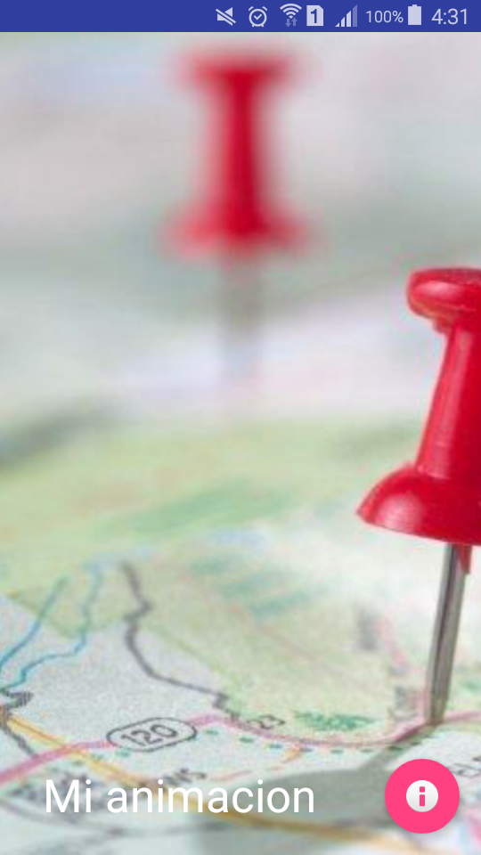
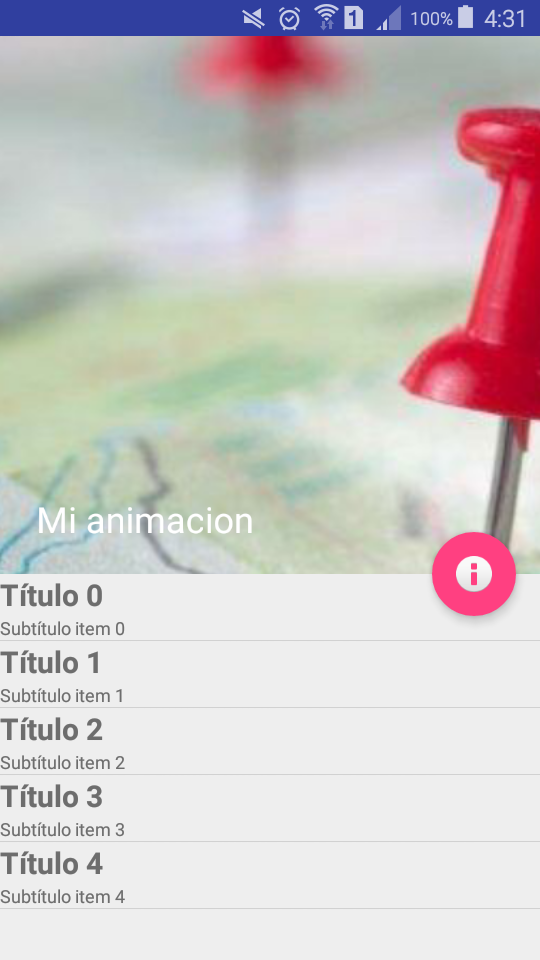
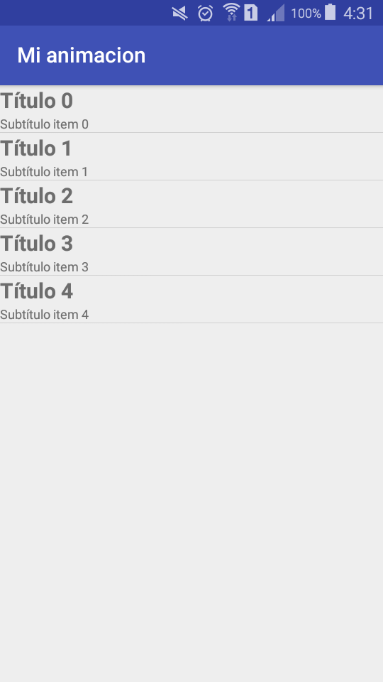

# Descripcion

##Ejemplo de las animaciones basicas de material
- [CollapsingToolbarLayout](https://developer.android.com/reference/android/support/design/widget/CollapsingToolbarLayout.html)
- [FloatingActionButton](https://developer.android.com/reference/android/support/design/widget/FloatingActionButton.html)
- [TabLayout](https://developer.android.com/reference/android/support/design/widget/TabLayout.html)
- [Toolbar](https://developer.android.com/reference/android/widget/Toolbar.html)




Parallax
El componente imagen que se uso para servir de fondo del appbar
```xml
 <ImageView
                android:id="@+id/imgToolbar"
                android:layout_width="match_parent"
                android:layout_height="match_parent"
                android:scaleType="centerCrop"
                android:src="@drawable/img_mapa"
                app:layout_collapseMode="parallax" />
```



Para que el boton se mueva junto con la appbar se establece mediante las siguientes lineas en el xml:
```xml
app:layout_anchor="@id/appbarlayout"
app:layout_anchorGravity="bottom|right|end"
```



###Social
- Twitter [@AldoGamaliel](https://twitter.com/AldoGamaliel)

- Google+ [+Aldo Estrada](https://plus.google.com/u/0/+AldoEstrada1992)
